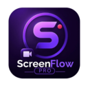
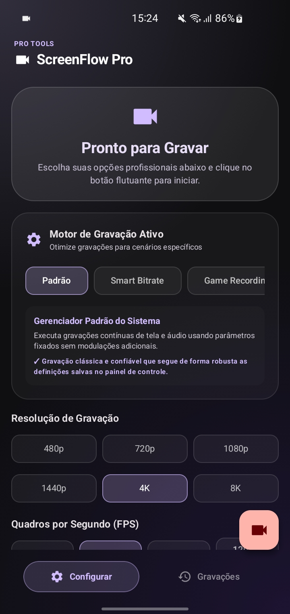
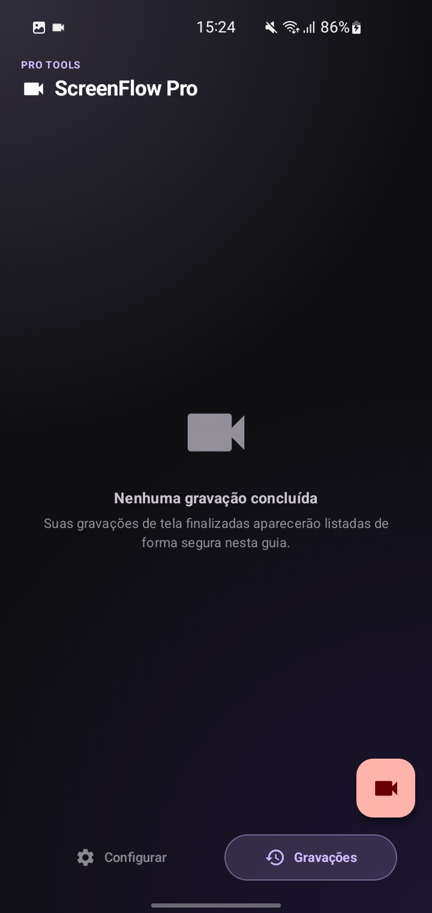

# ScreenFlow PRO

  

Um gravador de tela profissional e de código aberto, com um design moderno baseado no Material You. O ScreenFlow PRO oferece uma experiência de gravação de tela intuitiva e rica em recursos, ideal para criadores de conteúdo, desenvolvedores e qualquer pessoa que precise capturar sua tela com alta qualidade.

## Status do Projeto

Atualmente, o ScreenFlow PRO está na versão **Beta 1.0**. Estamos trabalhando ativamente para aprimorar a estabilidade, adicionar novos recursos e refinar a experiência do usuário. Agradecemos seu feedback e contribuições para tornar este projeto ainda melhor.

## Recursos Principais

*   **Design Material You:** Interface de usuário moderna e adaptável, seguindo as diretrizes do Material You para uma experiência visual agradável.
*   **Gravação de Alta Qualidade:** Capture sua tela com clareza e fluidez, ideal para tutoriais, demonstrações e gameplays.
*   **Código Aberto:** Transparência e flexibilidade para a comunidade contribuir e personalizar o aplicativo.
*   **Fácil de Usar:** Controles intuitivos para iniciar, pausar e parar gravações.

## Screenshots

Aqui estão algumas capturas de tela do ScreenFlow PRO em ação:

### Tela Principal de Gravação

  

### Tela de Gravações Concluídas

  

## Instalação e Uso

Detalhes sobre como instalar e executar o ScreenFlow PRO serão adicionados em breve. Por favor, verifique as próximas atualizações.

## Contribuição

Se você deseja contribuir para o desenvolvimento do ScreenFlow PRO, por favor, leia nosso guia de contribuição (CONTRIBUTING.md) para mais informações.

## Licença

Este projeto está licenciado sob a Licença MIT. Veja o arquivo `LICENSE` para mais detalhes.

## Atribuição

Desenvolvido por MANOSHOX FF.
